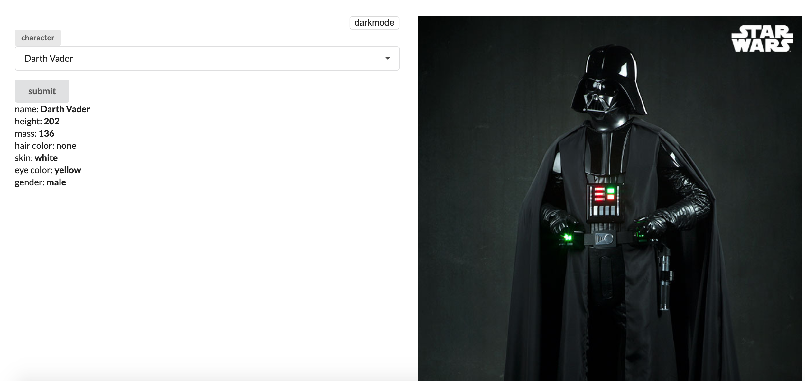
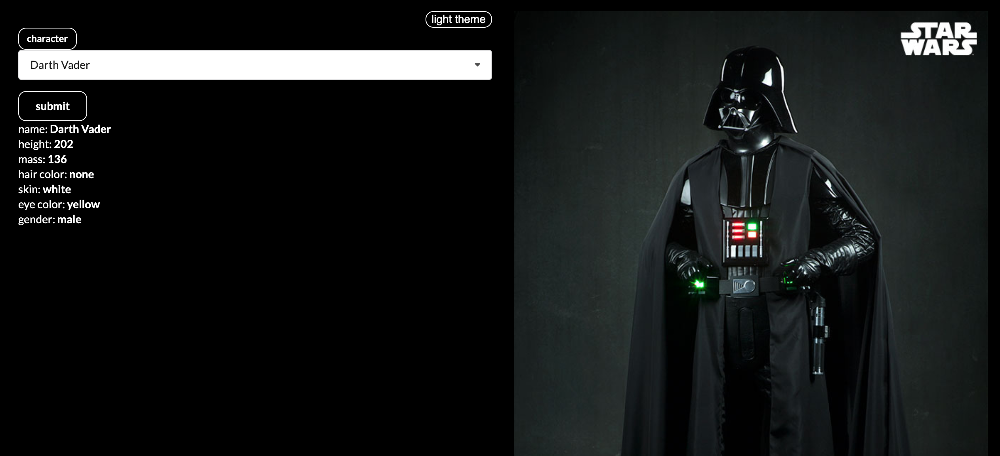

# training swapi :star:

Un projet d'entrainement avec l'api swapi sur star wars. 

## Technos utilisées :
React
Centralisation des données : React-Redux
Les appels API : Axios
Style UI : Semantic-UI
classnames: la gestion du dark theme

